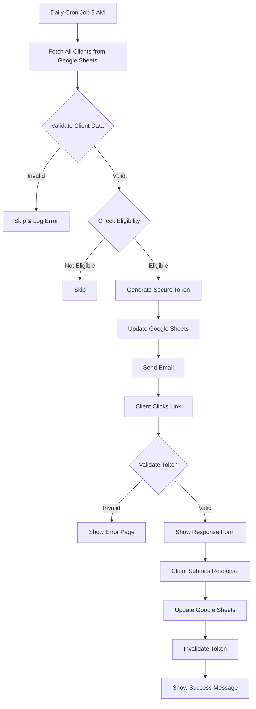

# Subscription Renewal Reminder System

A production-ready automated system that sends subscription renewal reminders via email 5 days before expiry, collects client responses through secure single-use links, and stores all data in Google Sheets.

## Features

✅ **Google Sheets Integration** - Uses Google Sheets as the primary database  
✅ **Automated Daily Reminders** - Cron job sends emails 5 days before subscription expiry  
✅ **Secure Single-Use Tokens** - UUID v4 + HMAC signature for tamper-proof links  
✅ **Beautiful Response Forms** - Modern, responsive UI for client responses  
✅ **Data Validation** - Comprehensive validation for manually entered data  
✅ **Rate Limiting** - Protection against abuse and brute-force attacks  
✅ **Email Service** - Professional HTML email templates  
✅ **Security First** - HTTPS, replay protection, input sanitization  

---

## Table of Contents

- [Prerequisites](#prerequisites)
- [Installation](#installation)
- [Configuration](#configuration)
- [Google Sheets Setup](#google-sheets-setup)
- [Running the Application](#running-the-application)
- [API Endpoints](#api-endpoints)
- [Deployment](#deployment)
- [Troubleshooting](#troubleshooting)

---

## Prerequisites

- **Node.js** v18+ and npm
- **Google Cloud Project** with Sheets API enabled
- **Gmail account** (or SendGrid/AWS SES for production)
- **Google Sheet** with proper structure

---

## Installation

1. **Clone or navigate to the project directory:**
   ```bash
   cd reminder-system
   ```

2. **Install dependencies:**
   ```bash
   npm install
   ```

3. **Copy environment template:**
   ```bash
   cp .env.example .env
   ```

---

## Configuration

### 1. Environment Variables

Edit `.env` file with your configuration:

```bash
# Google Sheets
GOOGLE_SHEET_ID=your_google_sheet_id_here
GOOGLE_SERVICE_ACCOUNT_EMAIL=your-service-account@project-id.iam.gserviceaccount.com

# Email Configuration
EMAIL_SERVICE=gmail
EMAIL_USER=your-email@gmail.com
EMAIL_APP_PASSWORD=your-gmail-app-password
EMAIL_FROM=noreply@yourcompany.com
COMPANY_NAME=Your Company Name

# Security
SECRET_KEY=generate-a-secure-random-key-here
NODE_ENV=development

# Application
PORT=3000
BASE_URL=http://localhost:3000

# Cron Schedule (9 AM daily)
CRON_SCHEDULE=0 9 * * *

# Configuration
TOKEN_EXPIRY_DAYS=7
REMINDER_DAYS_BEFORE=5
```

### 2. Generate Secret Key

Generate a secure random key for HMAC signatures:

```bash
node -e "console.log(require('crypto').randomBytes(32).toString('hex'))"
```

Copy the output and set it as `SECRET_KEY` in `.env`.

### 3. Gmail App Password

For Gmail SMTP:
1. Enable 2-Factor Authentication on your Google account
2. Go to [Google App Passwords](https://myaccount.google.com/apppasswords)
3. Generate a new app password for "Mail"
4. Use this password as `EMAIL_APP_PASSWORD`

> **Production Note:** For production, use SendGrid, AWS SES, or Mailgun for better deliverability.

---

## Google Sheets Setup

### 1. Create Google Cloud Project

1. Go to [Google Cloud Console](https://console.cloud.google.com/)
2. Create a new project
3. Enable **Google Sheets API**

### 2. Create Service Account

1. Navigate to **IAM & Admin** → **Service Accounts**
2. Click **Create Service Account**
3. Name it (e.g., "sheets-reminder-service")
4. Grant role: **Editor** (or custom role with Sheets access)
5. Click **Done**

### 3. Generate Credentials

1. Click on the created service account
2. Go to **Keys** tab
3. Click **Add Key** → **Create New Key**
4. Choose **JSON** format
5. Download the JSON file
6. Rename it to `google-service-account.json`
7. Move it to `credentials/` folder in your project

### 4. Create Google Sheet

1. Create a new Google Sheet
2. Add the following columns in **Row 1** (header):

   ```
   A: Client ID
   B: Client Name
   C: Email
   D: Mobile Number
   E: Subscription Start Date
   F: Subscription Expiry Date
   G: Subscription Status
   H: Payment Status
   I: Reminder Sent
   J: Reminder Sent Date
   K: Secure Token
   L: Token Expiry
   M: Client Response
   N: Response Date
   ```

3. **Share the sheet** with the service account email:
   - Click **Share** button
   - Paste the service account email from the JSON file (`client_email` field)
   - Give **Editor** permissions

4. **Copy the Sheet ID** from the URL:
   ```
   https://docs.google.com/spreadsheets/d/SHEET_ID_HERE/edit
   ```
   Set this as `GOOGLE_SHEET_ID` in `.env`

### 5. Sample Data Format

| Column | Example Value | Valid Values |
|--------|--------------|--------------|
| Client ID | C001 | Any unique string |
| Client Name | John Doe | 2-100 characters |
| Email | john@example.com | Valid email format |
| Mobile Number | +1234567890 | Optional |
| Subscription Start Date | 2026-01-01 | YYYY-MM-DD format |
| Subscription Expiry Date | 2026-12-31 | YYYY-MM-DD format |
| Subscription Status | Active | Active / Expired / Cancelled |
| Payment Status | Paid | Paid / Pending / Overdue |
| Reminder Sent | No | Yes / No |
| Reminder Sent Date | | Auto-filled by system |
| Secure Token | | Auto-generated by system |
| Token Expiry | | Auto-generated by system |
| Client Response | No Response | Interested / Not Interested / No Response |
| Response Date | | Auto-filled by system |

---

## Running the Application

### Development Mode

```bash
npm run dev
```

This uses `nodemon` for auto-restart on file changes.

### Production Mode

```bash
npm start
```

### Manual Cron Trigger (Testing)

You can manually trigger the cron job for testing:

```bash
curl -X POST http://localhost:3000/admin/trigger-cron \
  -H "x-api-key: YOUR_SECRET_KEY"
```

---

## API Endpoints

### Public Endpoints

#### `GET /response/:token`
Display response form for client.

**Response:** HTML page with YES/NO buttons

#### `POST /response/:token`
Submit client response.

**Body:**
```json
{
  "response": "Interested" // or "Not Interested"
}
```

**Response:**
```json
{
  "success": true,
  "message": "Thank you for your response!"
}
```

#### `GET /health`
Health check endpoint.

**Response:**
```json
{
  "status": "ok",
  "timestamp": "2026-02-12T12:00:00.000Z",
  "environment": "development"
}
```

### Admin Endpoints

#### `POST /admin/trigger-cron`
Manually trigger cron job (requires API key).

**Headers:**
```
x-api-key: YOUR_SECRET_KEY
```

**Response:**
```json
{
  "success": true,
  "message": "Cron job executed successfully",
  "stats": {
    "total": 100,
    "eligible": 5,
    "sent": 5,
    "failed": 0,
    "errors": []
  }
}
```

---

## Deployment

### Option 1: Railway (Recommended)

1. Create account at [Railway.app](https://railway.app/)
2. Click **New Project** → **Deploy from GitHub**
3. Select your repository
4. Add environment variables from `.env`
5. Upload `google-service-account.json` as a file
6. Deploy!

Railway automatically handles:
- HTTPS certificates
- Environment variables
- Cron job scheduling
- Auto-scaling

### Option 2: Render

1. Create account at [Render.com](https://render.com/)
2. Click **New** → **Web Service**
3. Connect your repository
4. Set build command: `npm install`
5. Set start command: `npm start`
6. Add environment variables
7. Upload service account JSON
8. Deploy!

### Option 3: AWS EC2

1. Launch Ubuntu EC2 instance
2. Install Node.js:
   ```bash
   curl -fsSL https://deb.nodesource.com/setup_18.x | sudo -E bash -
   sudo apt-get install -y nodejs
   ```
3. Clone repository and install dependencies
4. Install PM2:
   ```bash
   sudo npm install -g pm2
   pm2 start server.js --name reminder-system
   pm2 startup
   pm2 save
   ```
5. Configure nginx as reverse proxy
6. Set up SSL with Let's Encrypt

### Option 4: Vercel (Serverless)

1. Install Vercel CLI: `npm i -g vercel`
2. Create `vercel.json`:
   ```json
   {
     "version": 2,
     "builds": [{ "src": "server.js", "use": "@vercel/node" }],
     "routes": [{ "src": "/(.*)", "dest": "/server.js" }],
     "crons": [{
       "path": "/admin/trigger-cron",
       "schedule": "0 9 * * *"
     }]
   }
   ```
3. Deploy: `vercel --prod`

---

## System Workflow



---

## Security Features

- **HTTPS Only** - Enforced in production
- **Rate Limiting** - 10 requests per 15 minutes per IP
- **HMAC Signatures** - Tamper-proof tokens
- **Single-Use Tokens** - Automatically invalidated after use
- **Token Expiry** - 7-day expiration window
- **Input Validation** - All inputs sanitized and validated
- **Replay Protection** - Timestamp and signature validation
- **Helmet.js** - Security headers
- **CORS** - Restricted origins in production

---

## Troubleshooting

### Email Not Sending

1. **Check Gmail App Password:**
   - Ensure 2FA is enabled
   - Generate new app password
   - Use the 16-character password (no spaces)

2. **Check Email Service:**
   ```bash
   # Test email configuration
   node -e "require('./src/config/email')"
   ```

3. **Gmail Daily Limit:**
   - Gmail SMTP: 500 emails/day
   - Consider SendGrid (100/day free) or AWS SES

### Google Sheets API Errors

1. **Permission Denied:**
   - Ensure sheet is shared with service account email
   - Check service account has Editor role

2. **Invalid Credentials:**
   - Verify `google-service-account.json` path
   - Check `GOOGLE_SHEET_ID` in `.env`

3. **Quota Exceeded:**
   - Google Sheets API: 500 requests per 100 seconds
   - Implement caching for large datasets

### Cron Job Not Running

1. **Check Cron Schedule:**
   ```bash
   # Validate cron expression
   node -e "console.log(require('node-cron').validate('0 9 * * *'))"
   ```

2. **Manual Trigger:**
   ```bash
   curl -X POST http://localhost:3000/admin/trigger-cron \
     -H "x-api-key: YOUR_SECRET_KEY"
   ```

3. **Check Logs:**
   ```bash
   tail -f logs/app.log
   ```

---

## Project Structure

```
reminder-system/
├── src/
│   ├── config/
│   │   ├── env.js              # Environment configuration
│   │   ├── sheets.js           # Google Sheets client
│   │   └── email.js            # Email transporter
│   ├── services/
│   │   ├── sheetsService.js    # Google Sheets operations
│   │   ├── validationService.js # Data validation
│   │   ├── tokenService.js     # Token generation/validation
│   │   ├── emailService.js     # Email sending
│   │   └── cronService.js      # Cron job logic
│   ├── middleware/
│   │   ├── rateLimiter.js      # Rate limiting
│   │   ├── errorHandler.js     # Error handling
│   │   └── validator.js        # Request validation
│   ├── routes/
│   │   ├── response.js         # Response endpoints
│   │   └── admin.js            # Admin endpoints
│   ├── views/
│   │   └── error.html          # Error page
│   └── utils/
│       ├── logger.js           # Logging utility
│       └── dateHelper.js       # Date helpers
├── credentials/
│   └── google-service-account.json
├── logs/
│   └── app.log
├── .env
├── .env.example
├── .gitignore
├── package.json
├── server.js
└── README.md
```

---

## License

MIT

---

## Support

For issues or questions, please check:
1. This README
2. Google Sheets API documentation
3. Nodemailer documentation
4. Create an issue in the repository

---

**Built with ❤️ for automated subscription management**
